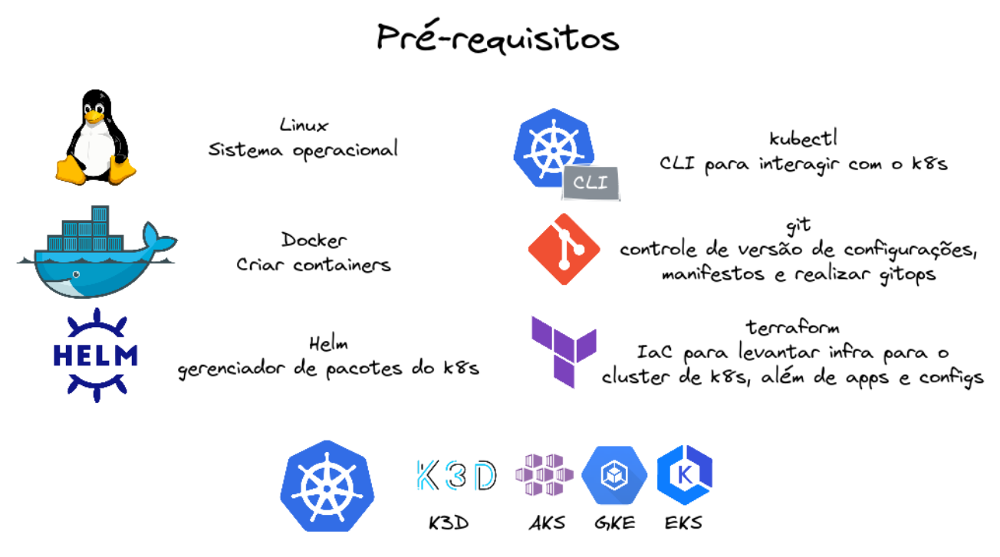

# big_data_k8s

## [Install prereqs](prereq.md)


## k3d Kubernetes Cluster
```sh 
k3d cluster create bigdatak8s --volume $HOME/bigdatak8s:/var/lib/rancher/k3s/storage@all -s 1 --servers-memory 4Gb -a 3 --agents-memory 12Gb --api-port 6443 -p 8081:80@loadbalancer
```
  - storage class: local-path em $HOME/bigdatak8s
  - 1 control plane - 4Gb
  - 3 worker node - 12Gb
  - port-foward 80 para 8081

## Argo CD
- kubectx k3d-bigdata
- alias k=kubectl
- Create namespaces:
```sh
k create namespace cicd
k create namespace database
k create namespace ingestion
k create namespace orchestrator
```
- Helm chart do ArgoCD baixado e yaml values alterado para usar ingress (params.server.insecure: true,params.server.rootpath: '/argocd')
- Atualiza o ArgoCD com yaml values alterado:
```sh 
helm upgrade --install -f https://raw.githubusercontent.com/andreyolv/big_data_k8s/main/repository/helm-charts/argo-cd/values.yaml argocd argo/argo-cd --namespace cicd --debug --timeout 10m0s
```
- Aplica o yaml abaixo para usar ingress:
```sh 
k apply -f repository/svc-lbs/svc_ingress_argocd.yaml
```
- Olhar cluster:
```sh 
watch kubectl get all -n cicd
```
- App of Apps: 
```sh 
kubectl apply -f https://raw.githubusercontent.com/andreyolv/big_data_k8s/main/bigdatak8s.yaml
```
- Pega o IP do cluster com k get endpoins -n default e trocar em .kube/config
- Loga no ArgoCD: [http://127.0.0.1:8081/argocd/login](http://127.0.0.1:8081/argocd/login)
  - user: admin
  - password: 
  ```sh 
  kubectl -n cicd get secret argocd-initial-admin-secret -o jsonpath="{.data.password}" | base64 -d  | more
  ```
- Caso algo fique como degraded basta deletar, o argo irá recriar novamente. Apenas não delete o cicd/k8sexample
- Pausar o cluster para continuar outro dia:
```sh
k3d cluster stop bigdatak8s
```
- Reativar o cluster a partir de onde parou sem perder nada:
```sh
k3d cluster start bigdatak8s
```
