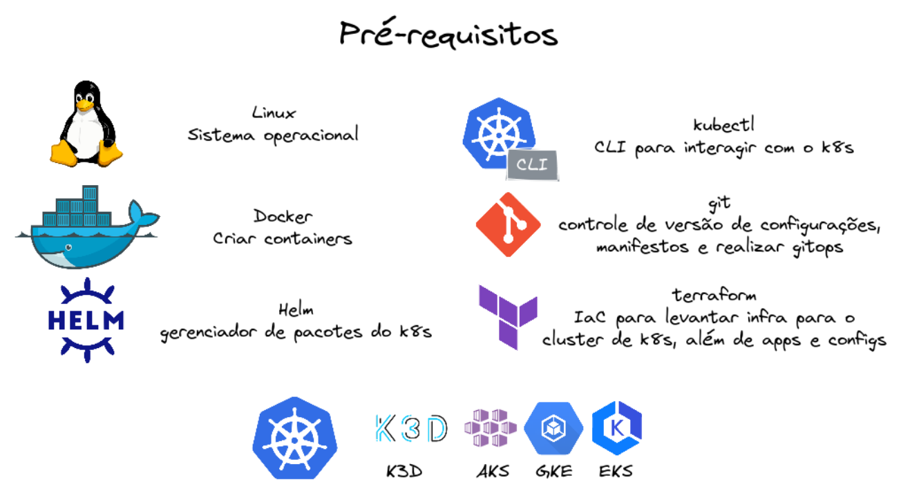

# big_data_k8s

## [Install prereqs](prereq.md)


## Kubernetes Cluster k3d
```sh 
k3d cluster create bigdatak8s --volume $HOME/bigdatak8s:/var/lib/rancher/k3s/storage@all -s 1 --servers-memory 4Gb -a 3 --agents-memory 12Gb --api-port 6443 -p 8081:80@loadbalancer
```
  - storage class: local-path em $HOME/bigdatak8s
  - 1 control plane - 4Gb
  - 3 worker node - 12Gb
  - port-foward 80 para 8081

## Argo CD
- kubectx k3d-bigdatak8s
- alias k=kubectl
- Create namespaces:
```sh
k create namespace cicd
k create namespace database
k create namespace ingestion
k create namespace orchestrator
k create namespace deepstorage
```

# Add Helm Repos
helm repo add argo https://argoproj.github.io/argo-helm

helm install argocd argo/argo-cd --namespace cicd --version 3.26.8

k patch svc argocd-server -n cicd -p '{"spec": {"type": "LoadBalancer"}}'

kubectl port-forward service/argocd-server -n cicd 8080:443

ARGOCD_LB="127.0.0.1"
kubens cicd && k get secret argocd-initial-admin-secret -o jsonpath="{.data.password}" | base64 -d | xargs -t -I {} argocd login $ARGOCD_LB --username admin --password {} --insecure

k create clusterrolebinding cluster-admin-binding --clusterrole=cluster-admin --user=system:serviceaccount:cicd:argocd-application-controller -n cicd

CLUSTER="k3d-bigdatak8s"
argocd cluster add $CLUSTER --in-cluster


- Pausar o cluster para continuar outro dia:
```sh
k3d cluster stop bigdatak8s
```
- Reativar o cluster a partir de onde parou sem perder nada:
```sh
k3d cluster start bigdatak8s
```
k3d cluster delete bigdatak8s